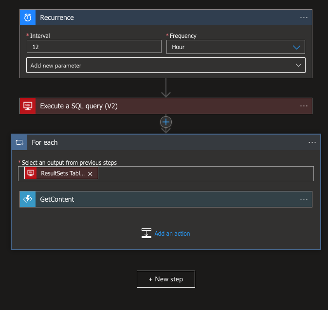

# Confluence AzureLanguageStudio Sample
This is a demostration on extracting content from Confluence Server, and send the information to Azure Language Studio to overlay AI - [Custom Question Answering](https://docs.microsoft.com/en-us/azure/cognitive-services/language-service/question-answering/overview).

## Content
This repository contains 2 folders. As the name suggested, __One-Time Ingestion__ is for initial ingestion, whereas second folder, __Azure Functions__ is a sample to use [Azure Functions](https://docs.microsoft.com/en-us/azure/azure-functions/) to trigger adhoc updates.

### One Time Ingestion
The logic is simple. First, we use [Confluence Server API](https://developer.atlassian.com/server/confluence/confluence-server-rest-api/) to get all content ID needed, then we will retrieve content of individual content id. Note that the body is in HTML markup format, with custom tag (for example, images), so we need to handle those tag by replacing with the right html tag.

Attachments such as images are returned as well, but it will only return attachment name, instead of the full content. Likewise, we will need to use Confluence API to retrieve the attachment data, store them in Azure Storage, generate a SAS URL for access purpose, and use this URL as src of HTML img tag. 

Custom Question Answering supports markdown as response, hence we then convert the HTML into markdown. Lastly, the title will be used as question, and the body content is used as response, and we leverage on [Azure Language Studio API](https://docs.microsoft.com/en-us/rest/api/cognitiveservices/questionanswering/question-answering-projects
) to perform update.


### Azure Functions
The logic is similar, but instead of crawling Confluence Server, Azure Functions take in request body:
```json
{
    "id": "123456",
    "title" : "Random text"
}
```

The input can be generated from either custom script, or query Confluence Server database **(NOT RECOMMENDED)**. Sample query script is available [here](assets/query.sql).

The automation can be triggered by Timer, using [Azure Logic Apps](https://docs.microsoft.com/en-us/azure/logic-apps/logic-apps-overview). Here's a sample flow, using SQL command above.
